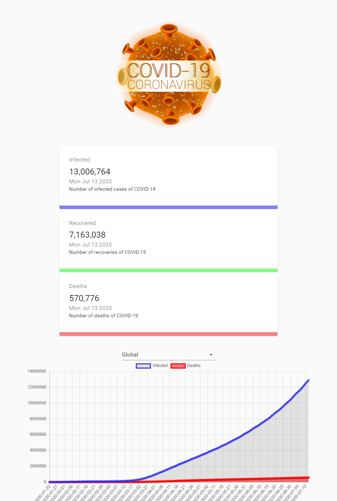

# Coronavirus Tracker Web Application

LIVE site - <https://example-covid-19-tracker.netlify.app>

With the unfortunate circumstance, I have decided to develop a web application to track the current cases of the pandemic and provide visual data of the statics. Please feel free to fork this project!

## Introduction

This application was developed with create-react-app. To load the page on port:3000, you must use Yarn Start.

## API 

The API I am utilizing for real-time data - <https://covid19.mathdro.id/api>

## Chart Visualization

I used Chart.js to present the visual data in a line graph and bar graph.

## Component layout

I used Material-UI to conveniently design my components. This allows me to focus on the logic of the application as material-ui designs my responsive components

## Countup

With visual increasing number format, I have used Countup from react-countup